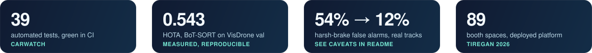
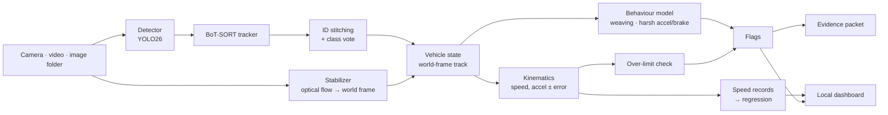
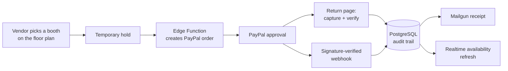

  
  
  
  

I study Computing Science at **Simon Fraser University** and build software around real workflows: event booking, operational dashboards, connected hardware, and computer-vision and decision-support prototypes. I’m especially interested in backend systems, machine-learning systems, and quantitative finance.

## Selected work

<table>
<tr>
<td width="50%" valign="top">

<a href="https://tcicsbooking.com">Live site</a> · <a href="https://github.com/Bardmalek/TCICS">Case study</a>
</td>
<td width="50%" valign="top">

<a href="https://github.com/Bardmalek/carwatch">Repository</a> · <a href="https://github.com/Bardmalek/carwatch/actions">CI</a>
</td>
</tr>
<tr>
<td width="50%" valign="top">

<a href="https://venuemap-gamma.vercel.app">Live preview</a> · <a href="https://github.com/Bardmalek/venuemap">Repository</a>
</td>
<td width="50%" valign="top">

<a href="https://github.com/Bardmalek/xplane-emergency-assistant">Repository</a> · <a href="https://github.com/Bardmalek/xplane-emergency-assistant/actions">CI</a>
</td>
</tr>
<tr>
<td width="50%" valign="top">

<a href="https://github.com/Bardmalek/sensory-substitution-kit">Repository</a>
</td>
<td width="50%" valign="middle" align="center">
More on the <a href="https://bardmalek.github.io">interactive portfolio</a>: project filters, a results explorer, and a booking-flow walkthrough.
</td>
</tr>
</table>

## Under the hood

Open a section to see how things work.

<b>CarWatch: how the pipeline works</b>

Every number carries an error bar, flags describe driving *patterns* (never impairment), and everything stays on `127.0.0.1`. [Read the write-up →](https://github.com/Bardmalek/carwatch)

<b>CarWatch: results at a glance (with caveats)</b>

| Tracker (VisDrone val, vehicles) | HOTA | IDF1 | ID switches |
| :--- | ---: | ---: | ---: |
| ByteTrack | 0.482 | 0.557 | 329 |
| **BoT-SORT** | **0.543** | **0.643** | **104** |
| BoT-SORT + ReID | 0.540 | 0.643 | 144 |

| Behaviour flags on real tracks | Harsh false alarms | Weave false alarms |
| :--- | ---: | ---: |
| Hand-set rules | 54% | 11% |
| Learned, synthetic only | 35% | 10% |
| Learned, real tracks + synthetic | **12%** | **5%** |

> Not real-world accuracy. Real tracks stand in for normal traffic and events are *injected* with known labels, tested leave-one-sequence-out. No labelled real driving events exist yet. Sliced inference is documented as a negative result: higher recall, lower F1, about 15× slower.

<b>Tiregan: how a booking flows</b>

Seven TypeScript Edge Functions, Row Level Security so anonymous users can only read booth availability, and database audit triggers that keep before/after records of booking changes. [Case study →](https://github.com/Bardmalek/TCICS)

## Things I work with

  
  
  
  
  
  
  
  
  
  
  

Built in Vancouver · Always iterating

